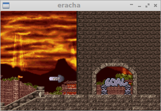

Eracha Project
==============

This is a little project to reverse engineer/reimplement parts of the ERACHA
platformer, made by korean game developers Mirinae Software and released for
DOS in 1996. There has also been a re-release on CD-Rom by Green Pepper and a
demo version.

Assorted notes about the used file formats are in the `reverse_engineering/doc`
directory and some hacked up helper programs to deal (extract and convert) with
them in the `reverse_engineering/tools` directory.

The goal is to create an cross platform interpreter of the game sometime.

Current implemented features of the interpreter:

 * basic data file loading (map, background, music...)
 * drawing of the static level elements and background
 * playing of music

Screenshots
-----------

Legal Disclaimer
----------------

I know that the game is not Freeware and therefore I will not provide any
of the original files, also not a dump of unpacked files from the archive
formats.
It is in your responsibility to get the data files from your floppy disk/cd or
any of the abandonware websites.
Considering the company has closed down several years ago and nobody is done
any harm by this, I can release all tools and even an interpreter of the
data files free of charge.

See LICENSE.md for details.

carstene1ns, 2014
