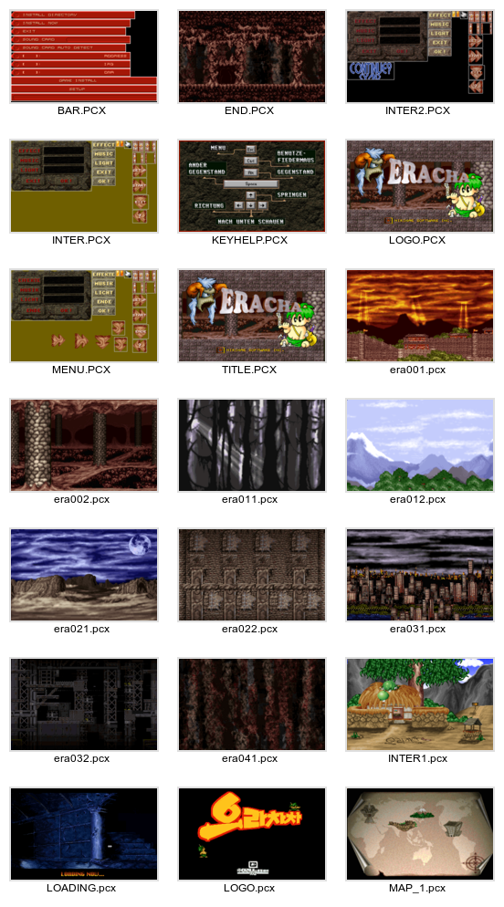

Background Format
=================

BCK files are basically PCX format files with different header (256 colors,
with palette).

HEADER
------

length: 0x14 (20) bytes

 * offset 0x0 - 0x13: file magic "0x07 [SaemSong]PCXtoHNP 0x1A"

DATA
----

 * raw image data

FOOTER
------

length: 0x300 (768) bytes

 * 256 color palette

---

Additional Information
----------------------

Because the pcx-header is removed, there is no dimensions defined in the file
itself. I guessed 320x200, because that was the most used resolution back then.
So, if we replace the custom header with a standard pcx header, set bit depth
to 8, dimensions 319x199 and empty 16 colors palette, the Gimp can open the
images without complaining.

```edc``` can convert bck to pcx.

A thumbnail of the converted backgrounds (eraXXX.pcx) and the other included
pcx files is available here:


