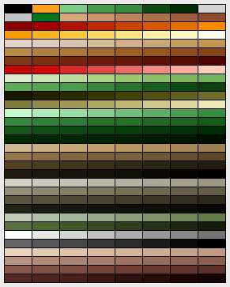

PAL Format
==========

Two different formats used by OPEN.PAL and SYSTEM.PAL, contains an array of 256
color palettes.

OPEN.PAL
--------

1 block (768 bytes), not used by the game, I guess it is compiled in for the
opening and menu and was used by their graphics editor.
Uses 6 bits (vga palette), needs to be shifted before use. It can be included
in extracted images from open[1/2].san and probably others.

SYSTEM.PAL
----------

WIP!

86 blocks + magic stuff, probably for fading effects. I have yet to clarify
the additional bytes (This is not easy without knowing how the original game
exactly uses this).

---

Additional Information
----------------------

```pal2gpl``` can convert to a Gimp Palette.
```pal2png``` can convert to a PNG Image.

OPEN.PAL looks like this:


