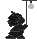

Assorted notes about SAN/SCB Format
===================================

Main graphics format for objects.

SAN - sprite animation
SCB - coordinates?

Not all SAN files have a corresponding SCB file, but they are clearly related.
It seems that only enemies have it and other objects not. I guess, that it is
related to the fact that they can hurt the player.

SAN HEADER
----------

0x0 - 0x9: file magic '[SaemSong]'

0xA: number of frames in animation

0xC - EOF: Image data, see below.

IMAGE DATA HEADER
-----------------

0x0: width

0x2: height

0x4 - 0x5: size in bytes

0x6 - 0x8: padding (0x0)

0x9 - end of image: 8 bit pixels (with exeption of 0x0, see below)

Pixel RLE
---------

The value 0x0 is used for transparency and is run-length encoded.
This means whenever a pixel with value 0x0 occurs, the next byte does not
contain the next pixel, but the count of transparent pixels in the current
row instead. The pixel has to be skipped and appropriate count of pixels
has to be added.

SCB HEADER
----------

0x0: number of frames

0x2: 1 (unknown magic)

0x4 - EOF: 16 bytes per frame

Additional Information
----------------------

```san2ascii``` can output ascii representation of san files and ```edc```
can convert to multiple ppm files (every bitmap-like is easily possible,
but they do not support multiple frames).
Currently only the pixel data is extracted (no palette parsed), so the images
will be in shades of gray.

An example is available here (converted to gif for convenience):


