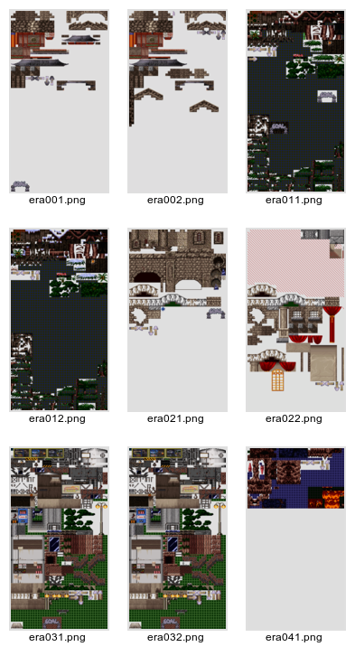

TIL Format
==========

Tile data: all floors, background objects and other stuff, saved in 8x8 pixel
blocks with palette at the end.
The tiles can be arranged to 40 in a row, output is then a 320x600 pixels image.

HEADER
------

0x0 - 0x12: file magic "*SaemSong Tile Data*"

0x13: tile size (always 8, so a tile is 8x8=64 pixels)

0x14 - 0x15: tile count (always 3000)

FOOTER
------

768 bytes palette with 256 colors rgb in vga format (needs to be shifted)

---

Additional Information
----------------------

```til2png``` can convert tile data to a png image.

A thumbnail of the converted tiles is available here:


