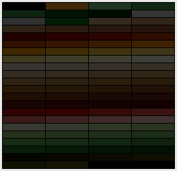

PAL Format
==========

Used by OPEN.PAL and SYSTEM.PAL

Contains an array of 256 color palettes

OPEN.PAL: 1 array, not used by the game, I guess it was used by their editor,
          this means it can easily be included in extracted images.

SYSTEM.PAL: ~ 259 blocks (probably for fading effects, have yet to clarify the
            additional bytes. This is not easy without knowing how the original
            game uses this.)

Additional Information
----------------------

```pal2gpl``` can convert to a Gimp Palette.

OPEN.PAL looks like this:


