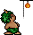

Assorted notes about SAN/SCB/STB Formats
========================================

Main graphics format for objects and enemies with corresponding data files.

 - SAN - sprite animation
 - SCB - coordinates? TODO
 - STB - movement/frames relation

Not all SAN files have a corresponding SCB file, but they are clearly related.
It seems that only enemies have it and other objects not. I guess, that it is
related to the fact that they can hurt the player. Certain enemies have a STB
file, it defines the movement paths if it is special. For example the ghosts:
There are different types of them, some cannot move without STB file, some only
move vertically to player position. It seems all enemies have a default
movement defined and any additional movement is defined in the STB file.
This explains some enemies (e.g. fireman) do not need it, because their
movement is only in one direction, towards the player.
The san graphics have no palette, the palette of the loaded til file is used.
If the san file is used in the menu, the compiled in palette (open.pal) is used
instead.

SAN HEADER
----------

 * offset 0x0 - 0x9: file magic '[SaemSong]'
 * offset 0xA: number of frames in animation
 * offset 0xC - EOF: Image data, see below.

IMAGE DATA HEADER
-----------------

 * offset 0x0: width
 * offset 0x2: height
 * offset 0x4 - 0x5: size in bytes
 * offset 0x6 - 0x8: padding (0x0)
 * offset 0x9 - end of image: 8 bit pixels (with exeption of 0x0, see below)

Pixel RLE
---------

The value 0x0 is used for transparency and is run-length encoded. This means
whenever a pixel with value 0x0 occurs, the next byte does not contain the next
pixel, but the count of transparent pixels in the current row instead. The
pixel has to be skipped and appropriate count of pixels has to be added.

SCB HEADER
----------

 * offset 0x0: number of frames
 * offset 0x2: 1 = enemy, 2 = special (double frames)
 * offset 0x4 - EOF: 16 bytes per frame

STB HEADER
----------

 * offset 0x0 - 0x1: number of 10 byte entries

---

Additional Information
----------------------

```san2ascii``` can output ascii representation of san files and ```san2png```
can convert to multiple png files. It uses a compiled in palette.

An example is available here (converted to gif for convenience):



For all images used in the opening screen and menu (open1.san, open2.san,
ctrlbox2.san, ...) the palette open.pal has to be used. An example (some frames
from open2.san) is available here (again converted to gif for convenience):


